<h1 align="center">Projeto Interdisciplinar - 2022</h1>

  

<h2> Cemitério Descanse Em Paz</h2>

<h2>📚 Sobre</h2>
O software Descanse em Paz é uma plataforma de gestão de cemitério, com intuito de auxiliar os funcionários nas rotinas diárias do trabalho administrativo. Desenvolvido na linguagem Java para sistema operacional Windows, o software permite ao funcionário cadastrar e manter jazidos, funcionários, falescidos. O software contém banco de dados e validação de login e geração. 

  

<h2 >🏆 Integrantes </h2>

  

Luiz Lessa CP3011569

Mayna Azevedo CP3010015

Pedro Vinicius CP3010007

<h2>C4 Model</h2>
- Diagrama de Contexto

  

- Diagrama de Container

  

- Diagrama de Componente

  

- Diagrama de Código

  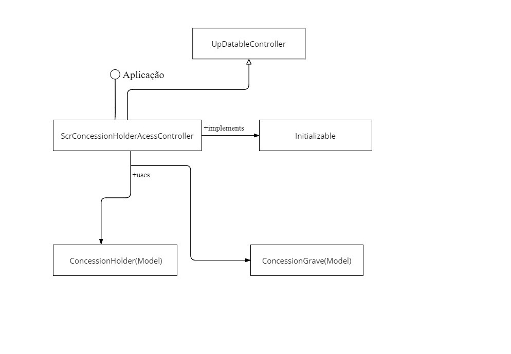

  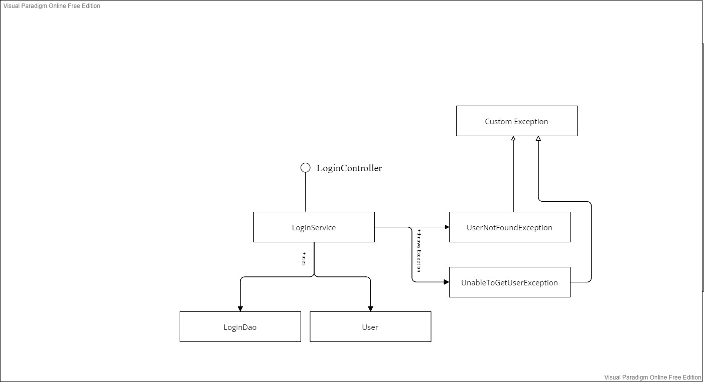

  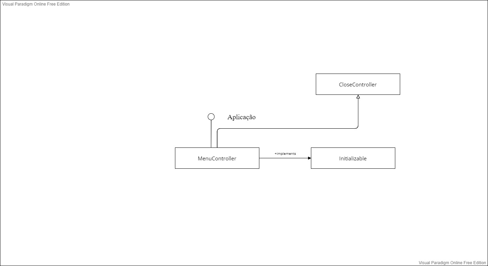

  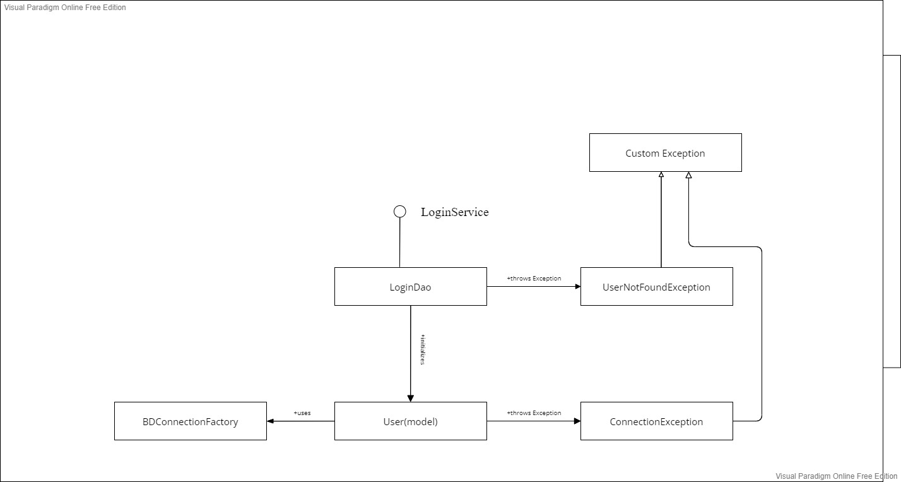

  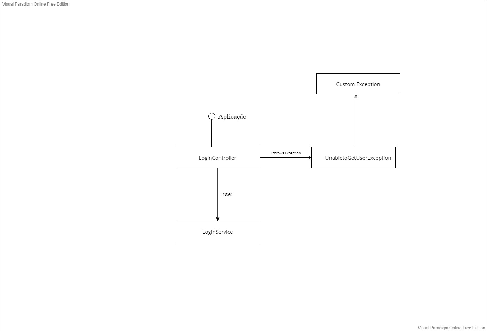

  

  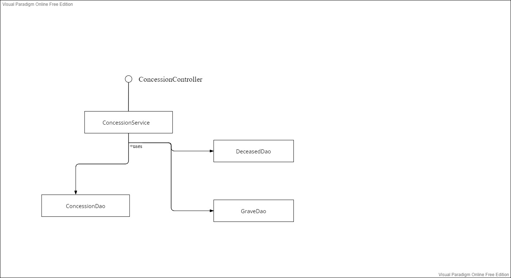

  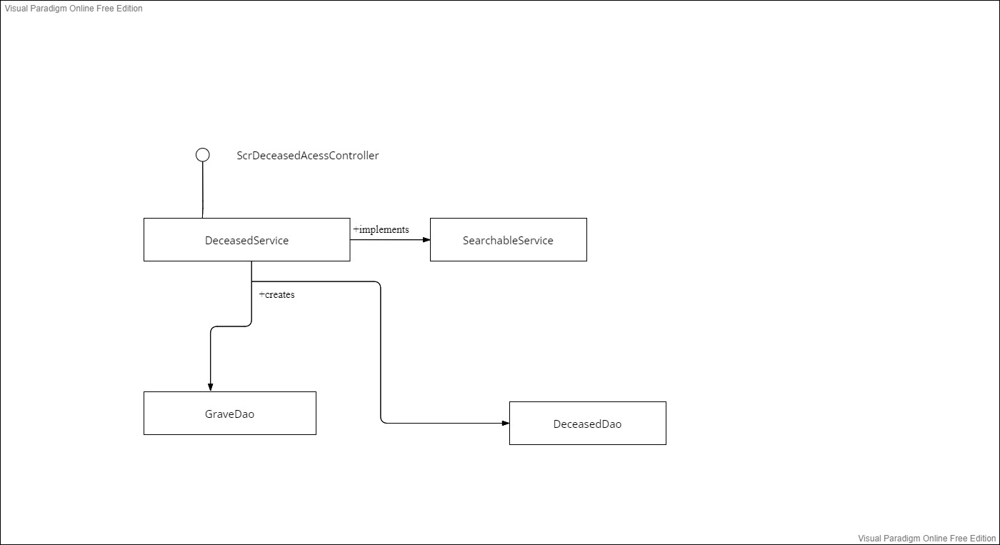

  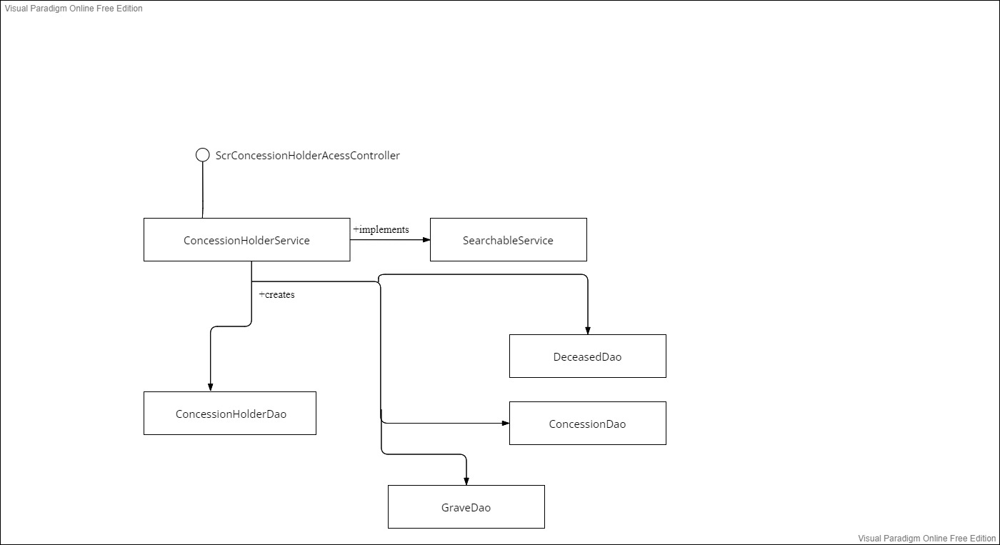

  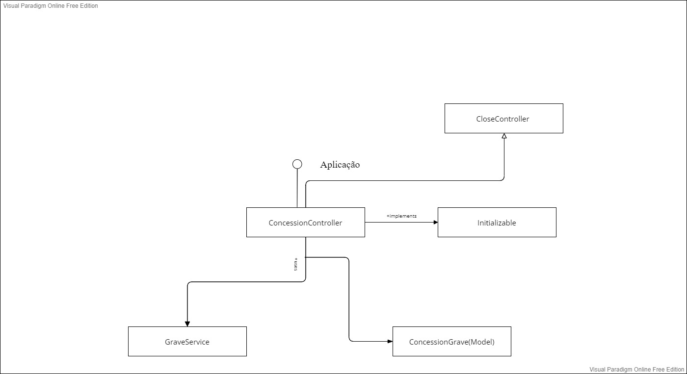

<h2>Padrões de Projeto</h2>
- Builder

  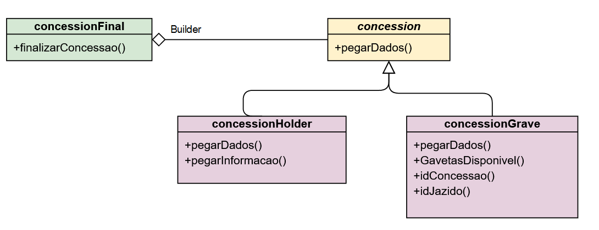

- Singleton

  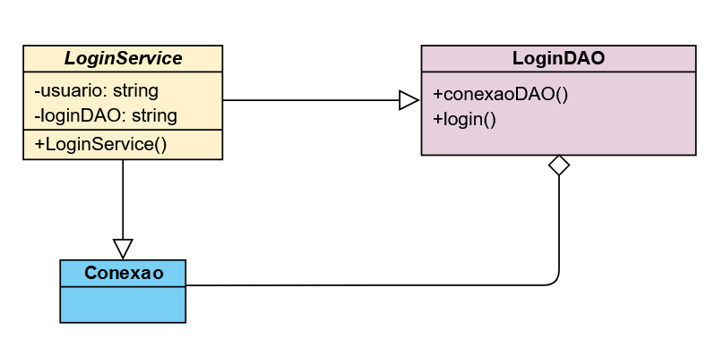

<h2>Considerações Finais</h2>

  

